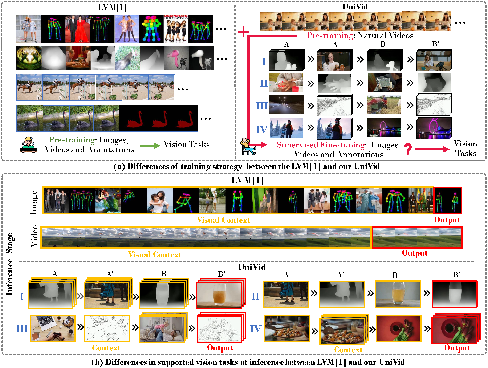
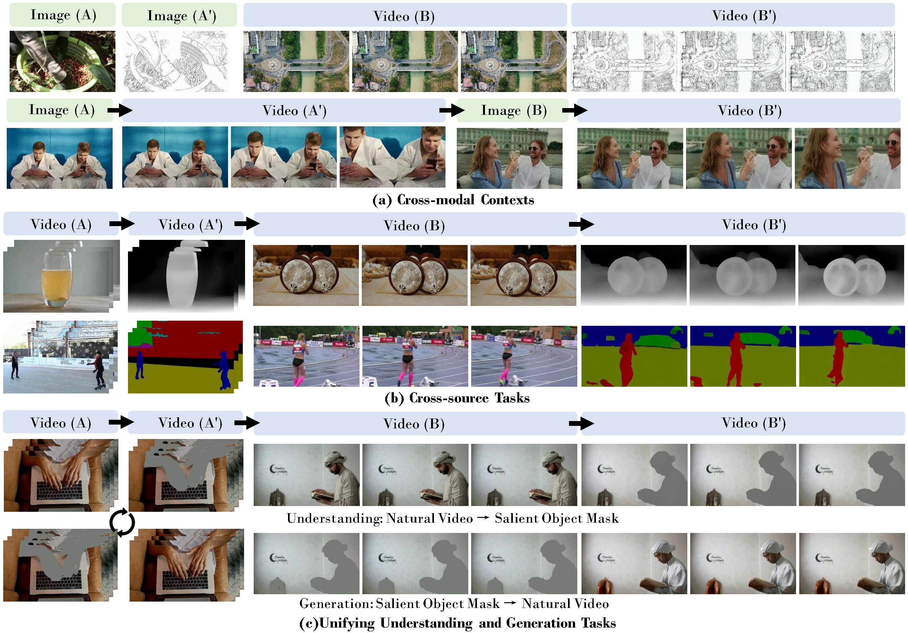

# UniVid

> **UniVid: Unifying Vision Tasks with Pre-trained Video Generation Models**
> <br>
> [Lan Chen](https://github.com/Orannue), 
> [Yuchao Gu](https:/lab/scholar.google.com/citations?user=YpfrXyQAAAAJ&hl=zh-CN)
> and 
> [Qi Mao](https://scholar.google.com/citations?user=VTQZF6EAAAAJ&hl=zh-CN)
> <br>
> [MIPG](https://github.com/CUC-MIPG), Communication University of China;
> [Show Lab](https://github.com/showlab), National University of Singapore
> <br>

<a href="https://www.arxiv.org/abs/2509.21760"></a>



## Getting Started

### 1. **Environment setup**
```bash
git clone https://github.com/CUC-MIPG/UniVid.git
cd Univid

conda create -n Univid python=3.11
conda activate Univid
```
### 2. **Requirements installation**
```bash
pip install requirements.txt
```
We use the open-source [DiffSynth-Studio](https://github.com/modelscope/DiffSynth-Studio) codebase to train UniVid. Please merge the ```diffSynth``` folder from this repository into the corresponding folder in [DiffSynth-Studio](https://github.com/modelscope/DiffSynth-Studio).

Then, run:
```
pip install -e .
```

### 3. **Dataset Preparation**
We provide an example dataset in ```dataset/camera-movement```, which includes a file named ```metadata.csv``` specifying each video path and its corresponding prompt.
Each video contains four clips arranged in the order $(A \rightarrow A' \rightarrow B \rightarrow B')$, each with the same length.  

Please ensure that each clip has exactly $4n + 1$ frames, and that the total number of frames in all four clips is less than $81$.

Run the script ```data_process.sh``` to preprocess the dataset.


### 4. **Start training**

Run the script ```train.sh``` to start training.

An example UniVid model for the camera movement task can be downloaded from [this link](https://drive.google.com/file/d/1V4HraIjlMrbPfAPivk5vYoq4bQTzcP4L/view?usp=sharing )


### 5. Inference

Run the script ```inference.sh``` for inference.


## Main Observations




